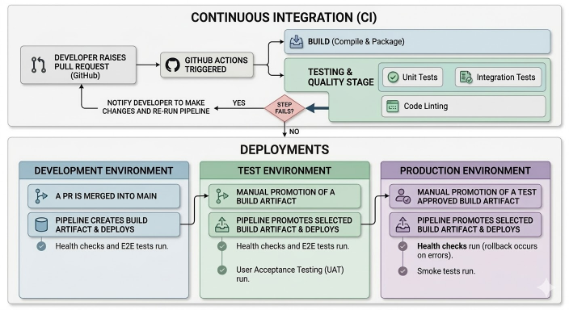

# CI/CD Pipeline & Automation

## Overview

Our **CI/CD pipeline** automates the integration, testing, and deployment of code changes. Using **GitHub**, **GitHub Actions**, **AWS CDK**, and **AWS CloudFormation**, we ensure that code is continuously integrated, tested, and deployed across multiple environments (development, test, and production) efficiently and consistently.

The main stages in our CI/CD pipeline include:

1. **Continuous Integration (CI)**: Automated testing and validation of code when changes are pushed.
2. **Continuous Delivery (CD)**: Deployments triggered by merges into `main` and through manual promotion of build artifacts.

---

## Key Stages of the CI/CD Pipeline

1. **Continuous Integration (CI)**

When changes on a feature branch are ready to be merged into `main` and a pull request is raised in GitHub, the CI pipeline is triggered via GitHub Actions.

**Steps in the CI Stage**:

- **Build**: The application is compiled and packaged.
- **Automated Testing**:
    - **Unit Tests**: Validate individual components or functions.
    - **Integration Tests**: Ensure that services interact correctly.
- **Code Linting**: Check for code quality and adherence to standards.

If any step fails, the pipeline notifies the developer to make changes and re-run the pipeline.

---

2. **Continuous Delivery (CD)**

**Development Environment**

- **Trigger**:
  - A PR is merged into `main`.

- **Action**:
  - The pipeline creates a build artifact and deploys it to the **development environment**.
  - Health checks and E2E tests run to validate the build.

**Test Environment**

- **Trigger**:
    - Manual promotion of a build artifact.
- **Action**:
    - The pipeline promotes the selected build artifact and deploys it to the **test environment**.
    - Health checks and E2E tests run to validate the build.
    - User Acceptance Testing (UAT) validates the end to end business workflow.

**Production Environment**

- **Trigger**:
    - Manual promotion of a test approved build artifact.
- **Action**:
  - The pipeline promotes the selected build artifact and deploys it to the **production environment**.
  - Health checks run to validate the build (rollback occurs on errors).
  - Smoke tests validate the stability of the application.

---

## Best Practices for CI/CD Pipeline

1. **Automate All Stages**

- **Automated Testing**: Ensure all deployments are validated with unit, integration, and E2E tests.
- **GitHub Actions for CI/CD**: Automate the build, test, and deployment processes.
- **Infrastructure as Code**: Use AWS CDK for consistent infrastructure management.

2. **Secure Secrets Management**

- **GitHub Secrets**: Store API keys, AWS credentials, and environment variables securely.
- **AWS IAM Roles**: Limit AWS permissions to only what is necessary for deployments.

3. **Environment-Specific Pipelines**

- **Development**: Frequent deployments for internal testing.
- **Test**: Ensures stable releases via UAT.
- **Production**: Controlled, automated deployments with monitoring.

4. **Rollback Mechanism**

- Build artifacts ensure rollback strategies in case of deployment failures.

5. **Monitor and Optimise Pipeline Performance**

- **Parallel Testing**: Speed up CI by running tests in parallel.
- **Monitoring**: Use AWS CloudWatch and GitHub Actions logs to track pipeline execution.

---

## Tools and Technologies

- **GitHub Actions**: Automates builds, tests, and deployments.
- **AWS CDK (Cloud Development Kit)**: Manages infrastructure as code.
- **AWS CloudFormation**: Deploys infrastructure across AWS environments.
- **GitHub Secrets**: Stores sensitive credentials securely.
- **Monitoring Tools**: AWS CloudWatch tracks application performance post-deployment.