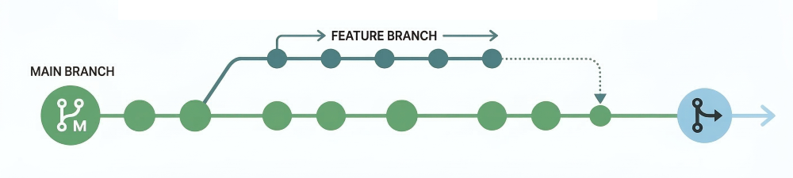

# Branching Strategy and Git Workflow

## Overview

Our development process follows a structured Git branching strategy to ensure smooth collaboration and deployment across environments. This strategy encourages frequent collaboration and continuous integration, with **feature / bugfix branches** for development, a **develop branch** for staging and testing, and a **main branch** for production deployments managed through GitHub and CI/CD pipelines.



---

## Key Concepts

1. **Main Branch (`main`)**:

    - Represents stable, production-ready code.
    - Code merged into `main` is automatically deployed to the **production environment**.

2. **Develop Branch (`develop`)**:

    - The integration branch for ongoing development.
    - All feature / bugfix branches must be merged into `develop` before going to `main`.
    - Code merged into `develop` is automatically deployed to the **test environment**.

3. **Feature and Bugfix Branches (`feature/*`, `bugfix/*`)**:

    - Each new feature or bug fix is developed in a separate branch created off of `develop`.
    - Feature branches should be named descriptively, including an issue ticket reference if applicable. For more details on how branches should be named, see [Git Branch and Commit Naming Conventions](naming-conventions.md#2-git-branch-and-commit-naming-conventions).
    - All changes are tested locally or in the **development environment** before being merged into `develop` through a Pull Request (PR) process. For details on how PRs should be named, see [Pull Request Naming Conventions](naming-conventions.md#3-pull-request-naming-conventions).

4. **Pull Requests (PRs)**:

    - Once a feature or fix is complete, create a pull request (PR) to merge the changes into the `develop` branch.
    - PRs must be reviewed and approved by at least one other team member before merging.
    - Automated tests (via CI pipelines) will run against each PR to ensure stability.

5. **Merging to `main`**:

    - After UAT / tests are complete, `develop` is merged into `main` via a PR.
    - Merging to `main` triggers an automatic deployment to the **production environment**.

6. **Syncing Branches**:

    - Always merge `main` back into `develop` to ensure features / bug fixes are being created from the latest stable, production-ready code.

---

## Workflow Example

1. **Create a Branch**:

    - From the `develop` branch, create a feature branch:

      ```bash
      git switch develop
      git pull origin develop
      git switch -C feature/your-feature-name
      # or for bug fixes: git switch -C bugfix/your-bugfix-name
      ```

2. **Work on Your Feature**:

    - Make meaningful commits to the feature branch, following the [Conventional Commits](../general-development-practices/coding-standards.md#commit-message-standards-conventional-commits) specification for commit messages.
    - Commit messages should include a type (e.g., `feat`, `fix`) and a short description of the change.
    - Always keep your branch up to date with any potential changes to `develop` through rebasing:

      ```bash
      git fetch origin
      git rebase origin/develop
      ```

3. **Push Your Branch to GitHub**:

    - Push your branch to the remote repository:

      ```bash
      git push -u origin feature/your-feature-name
      ```

4. **Open a Pull Request**:

    - Once the feature is complete, open a pull request to merge your feature branch into `develop`.

5. **Merging into `develop`**:

    - After your pull request has been reviewed and approved, and all CI tests pass, merge the feature branch into `develop` using a squash and merge commit.
    - This will trigger an automatic deployment to the **test environment**.

6. **Merging `develop` into `main`**:

    - Once the code in `develop` is stable and ready for production, create a PR from `develop` to `main`.
    - Review and approve the PR, and merge using a merge commit.

7. **Update `develop`**:

    - Update `develop` to bring the latest changes in `main`:

      ```bash
      git switch develop
      git pull origin develop
      git merge main
      git push origin develop
      ```