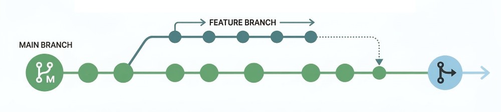

# Branching Strategy & Git Workflow

## Overview

Our development process follows a structured Git branching strategy to ensure smooth collaboration and management of code changes. This strategy encourages frequent collaboration and continuous integration, with **feature / bugfix branches** for development, and a **main branch** for creating build artifacts and deployments managed through GitHub and CI/CD pipelines.



---

## Key Concepts

1. **Main Branch (`main`)**:

    - Represents stable, deployable code.
    - Code merged into `main` is automatically deployed to the **development environment**.

2. **Feature and Bugfix Branches (`feature/*`, `bugfix/*`)**:

    - Each new feature or bug fix is developed in a separate branch created off of `main`.
    - Feature branches should be named descriptively, including an issue ticket reference if applicable. For more details on how branches should be named, see [Git Branch and Commit Naming Conventions](general-development-practices/naming-conventions.md#git-branches-and-commits).
    - All changes are tested locally before being merged into `main` through a Pull Request (PR) process. For details on how PRs should be named, see [Pull Request Naming Conventions](general-development-practices/naming-conventions.md#pull-requests).

4. **Pull Requests (PRs)**:

    - Once a feature or fix is complete, create a pull request (PR) to merge the changes into the `main` branch.
    - PRs must be reviewed and approved by at least one other team member before merging.
    - Automated tests (via CI pipelines) will run against each PR to ensure stability.

---

## Workflow Example

1. **Create a Branch**:

    - From the `main` branch, create a feature branch:

      ```bash
      git switch main
      git pull origin main
      git switch -c feature/your-feature-name
      # or for bug fixes: git switch -c bugfix/your-bugfix-name
      ```

2. **Work on Your Feature**:

    - Make meaningful commits to the feature branch, following the [Conventional Commits](../general-development-practices/coding-standards.md#commit-message-standards-conventional-commits) specification for commit messages.
    - Commit messages should include a type (e.g., `feat`, `fix`) and a short description of the change.
    - Always keep your branch up to date with any potential changes to `main` through rebasing:

      ```bash
      git fetch origin
      git rebase origin/main
      ```

3. **Push Your Branch to GitHub**:

    - Push your branch to the remote repository:

      ```bash
      git push -u origin feature/your-feature-name
      ```

4. **Open a Pull Request**:

    - Once the feature is complete, open a pull request to merge your feature branch into `main`.

5. **Merging into `main`**:

    - After your pull request has been reviewed and approved, and all CI tests pass, merge the feature branch into `main` using a squash and merge commit.
    - This will trigger an automatic deployment to the **development environment**.