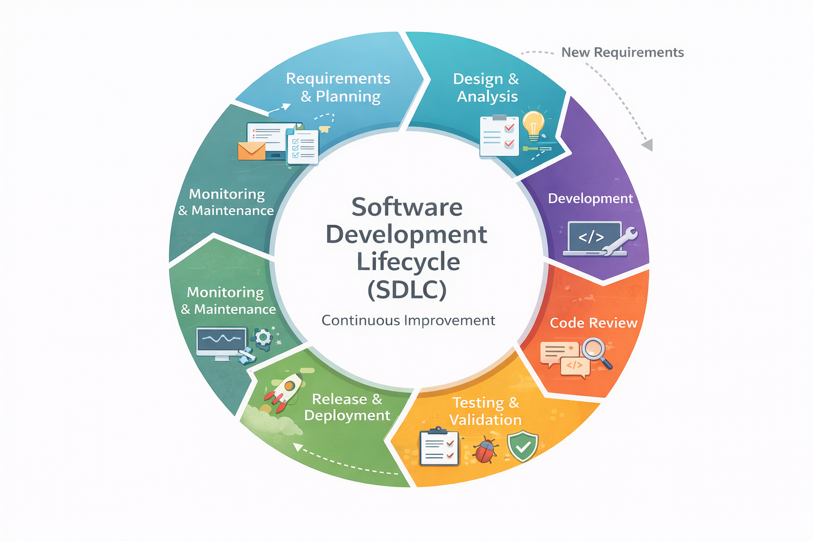

# Software Development Lifecycle

## Overview

The **Software Development Lifecycle (SDLC)** outlines the structured process our development team follows to ensure consistent, high-quality software delivery. This lifecycle guides our team from the initial gathering of requirements all the way through deployment and post-production monitoring. The process is designed to streamline workflows, maintain best practices, and enable continuous improvement through iteration.

The diagram below provides a visual representation of the SDLC stages our team follows:

---

## SDLC Stages

1. **Pre-Development**

The pre-development stage focuses on gathering requirements and defining the scope of the project before actual development work begins.

- **Key Activities**:
    - Obtain requirements from the business.
    - Define project scope and objectives.
    - Agree on timelines and set project milestones.
    - Create sprint tickets and organise them into the backlog for the development team.

This stage ensures that the project is properly scoped, and that all stakeholders are aligned on the goals before development begins.

2. **Local Development Environment**

Once the project is defined, development begins in a local environment. This is where the bulk of coding, testing, and iteration occurs.

- **Key Activities**:
    - Configure the project in a local environment, using templates and repositories (if required).
    - Set up a new repository or initialise the project based on an API template (if required).
    - Follow the [branching strategy](../general-development-practices/branching-strategy.md) by creating feature branches for development work.
    - Develop, code, and write unit tests, integration tests, and E2E tests.
    - Deploy to a development environment for initial tests.

During this stage, developers create and refine their code while continuously testing to ensure quality and adherence to best practices.

3. **Continuous Integration (CI) and Development Pipeline**

Prior to merging changes to the `develop` branch, the CI pipeline runs automated tests to ensure that the code is functional and stable.

- **Key Activities**:
    - CI/CD Pipeline automatically runs tests (unit, integration, and E2E tests).
    - If tests fail, the code is sent back to development for further changes and fixes.

This stage ensures that all code changes are continuously integrated into the system and validated with automated testing, reducing the risk of errors later in the process.

5. **Testing and Deployment to Test Environment**

Once a feature is ready, it’s merged to the `develop` branch after PR approval and deployed to the **test environment** for thorough validation, including User Acceptance Testing (UAT).

- **Key Activities**:
    - Code is merged to the `develop` branch (after peer review and approval).
    - Deploy to the test environment using AWS CDK and CloudFormation.
    - Run integration and smoke tests in the test environment to validate the deployment.
    - **UAT**: The testing team and stakeholders validate the release to ensure it meets business requirements.
    - If any issues arise during testing, changes are sent back to development for fixes and re-deployment.

This stage ensures that the application is tested in an environment that closely mirrors production, reducing the risk of issues in production.

6. **Deployment to Production**

Once the code has passed testing, it is prepared for deployment to the **production environment**.

- **Key Activities**:
    - Promote the release to production by raising a PR to merge to the `main` branch.
    - Deploy the application to production using AWS CDK and CloudFormation.
    - Run post-deployment smoke tests to ensure the application is functioning correctly in the production environment.

At this stage, the application goes live, and users can begin interacting with it.

7. **Post-Production Monitoring and Feedback**

After deployment to production, the application is continuously monitored to ensure stability, performance, and reliability.

- **Key Activities**:
    - Use AWS CloudWatch to monitor application performance, detect any potential issues, and set up alerts for critical errors.
    - Merge the `main` branch into `develop` to ensure any changes are synced.
    - If any issues arise, the development team can roll back to a previous stable version or issue hotfixes.
    - Sprint tickets are closed, and feedback from stakeholders is gathered for future iterations.

The post-production stage ensures that any issues are caught early and addressed quickly, allowing for continuous improvement.